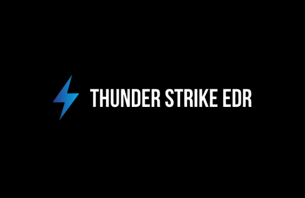

# ThunderStrike EDR 

## Introduction
I create this project to Learn Edr Internals and Windows kernel Programming. 

## 🚀 Features
It only has one feature right now which is inject a Hook DLL into each process using KAPC.
I will add More Features in the future. 

## ⚠️ Caution 
This project is under development, so please use it with caution. It is recommended to run it inside a virtual machine to avoid any risks to your main system.

## 📝 To-Do 

- Implement a memory scanner.
- Integrate basic logging and alerting system.
- Integrate ETW / ETW-TI 

## 📚 Resources
- Evading EDR Book (By Matt Hand).
- [SensePost – From Windows Drivers to an Almost Fully Working EDR (2024)](https://sensepost.com/blog/2024/sensecon-23-from-windows-drivers-to-an-almost-fully-working-edr/)
- [SensePost – mydumbEDR (GitHub)](https://github.com/sensepost/mydumbedr)
- [iRed Team – Subscribing to Process Creation, Thread Creation, and Image Load Notifications from a Kernel Driver](https://www.ired.team/miscellaneous-reversing-forensics/windows-kernel-internals/subscribing-to-process-creation-thread-creation-and-image-load-notifications-from-a-kernel-driver)
- [Experimenting with Protected Processes and Threat-Intelligence ](https://xacone.github.io/BestEdrOfTheMarketV3.html)
- [Xacone – BestEDROfTheMarket ](https://github.com/Xacone/BestEdrOfTheMarket)
- [EDR Development Playlist ](https://www.youtube.com/watch?v=vXRercv2iU8&list=PLc2_LEyTNutFkUliQMTZ_FHl8kNx3f5-E)
    - [vEDR Project](https://github.com/ytincodenito/vEDR)

